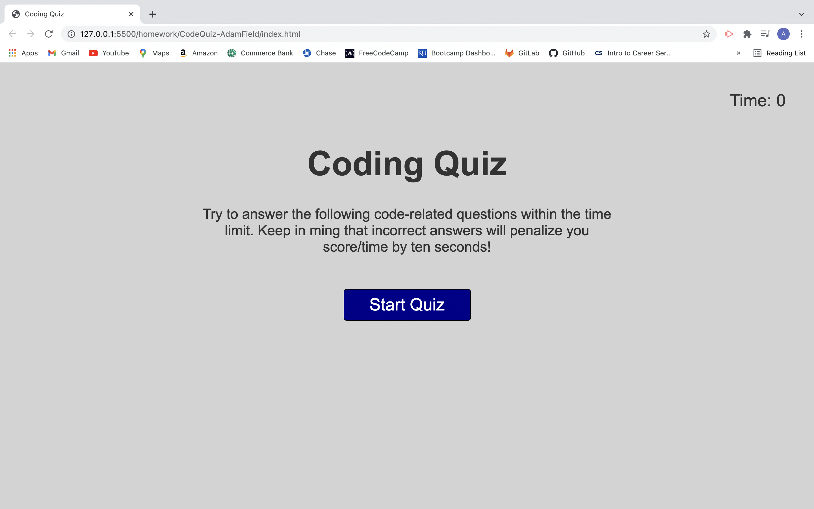
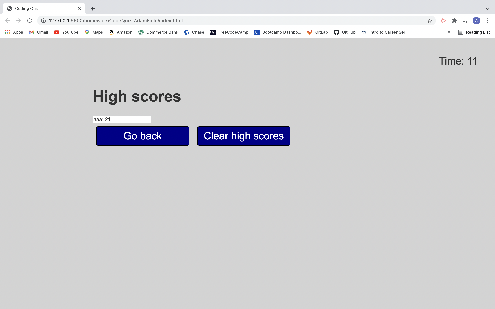

# CodeQuiz-AdamField

## Description
* Home page explains how the game is played and user is presented with a "Start Quiz" button when they are ready to start

* When quiz is start the user will be presenting with multiple choice questions

* If user answers the question incorrectly ten seconds will be deducted from the users time

* When all question are answer user will be presented with final score and be asked to end initials

* Users initials and score are saved to local storage

* user is shown current high score and given options to go back or clear high scores

## Link to deployed applications

https://adamjfield.github.io/CodeQuiz-AdamField/

## Screen shots 

